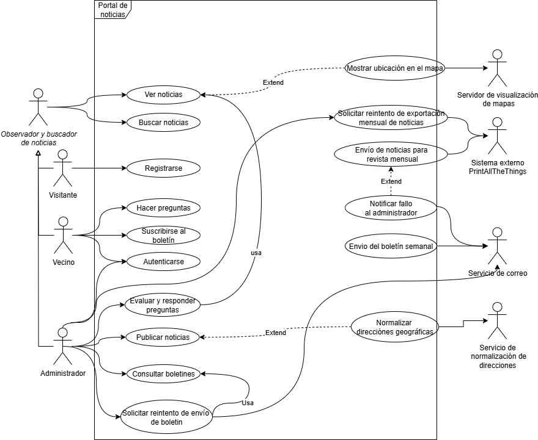
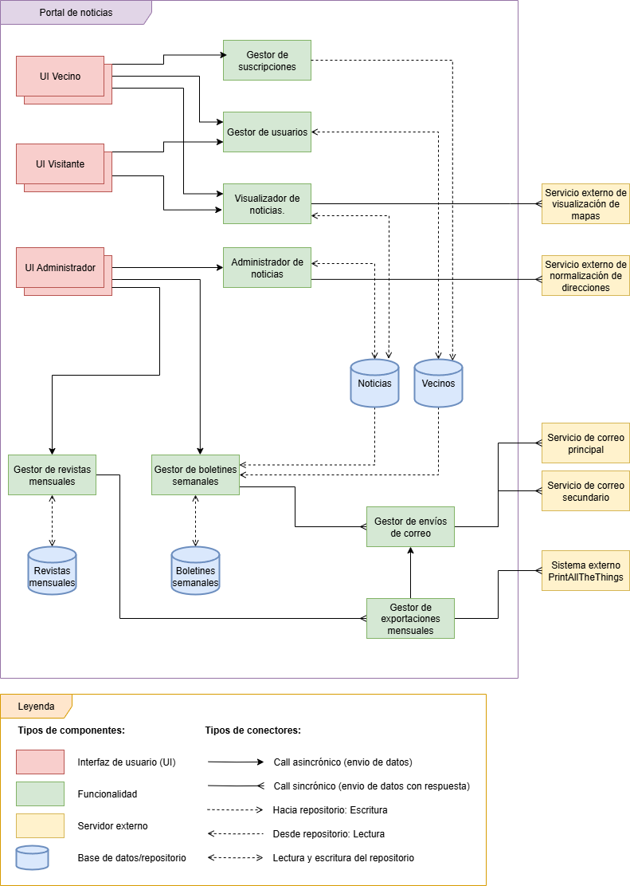

# Portal de Noticias – Prototipo Web

Prototipo de aplicación web para la **visualización y creación de noticias**, con integración de mapas interactivos mediante un **servicio externo REST** y renderizado con **Leaflet**.

Este proyecto pertenece a una de las tres entregas parciales del trabajo practico de la materia Ingeniería de Software I. La primera parte consistió en el ánalisis de requerimientos, clasificación y diseño de un diagrama de casos de Uso. La segunda entrega
se debió desarrollar este prototipo donde posee solo algunas de las funcionalidades y la última parte consistió en realizar un diagrama de arquitectura.

---

## Tecnologías utilizadas
- **Frontend:** HTML, CSS, JavaScript  
- **Mapas:** Normalización de direcciónes con servicio externo USIG, Visualización de mapas con libreria Leaflet.

---

## Funcionalidades
- Crear, visualizar y búscar noticias.
- Mostrar mapas que muestren una dirección particular de una noticia.
- Interfaz web simple y funcional.

---

## Diagramas

### Diagrama de Casos de Uso

### Diagrama de Arquitectura

---

## Estructura del repositorio
- /       -> Archivos HTML principales
- /css    -> Archivos de los estilos (CSS)
- /img    -> Imágenes utilizadas para la página
- /docs   -> Documentación y diagramas del diseño
- /js     -> Archivos de JavaScript

----
## Autores del proyecto
- Alegre Maximiliano
- Berini Bruno
- Baez Tomas
- Flores Maximo
